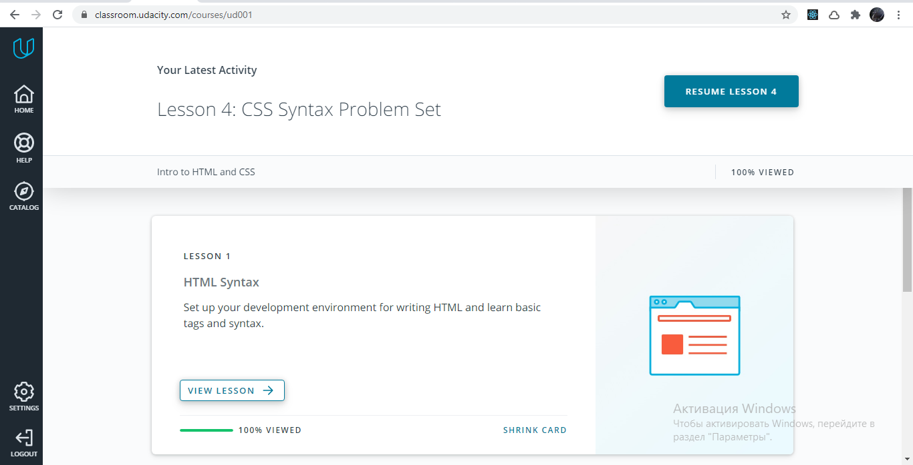

# kottans-frontend

Kottans fronend course

# stage0

- 🔥 **0 Git Basics** - [_DONE_](#git_basics)
- 🔥 **1 Linux CLI and Networking** - [_DONE_](#task_linux_cli)
- 🔥 **2 Git Collaboration** - [_DONE_](#task_git_collaboration)
- 🔥 **3 Intro to HTML and CSS** - [_DONE_](#task_html_css_intro)
- 🔥 **4 Responsive Web Design** - [_DONE_](#task_responsive_web_design)
- 🔥 **5 HTML & CSS practice** - [_DONE_](#html_css_popup)
- 🔥 **6 JS Basics** - [_DONE_](#task_js_basics)
- 🔥 **7 DOM** - [_DONE_](#task_js_dom)
- 🔥 **8 JS pre OOP** - [_DONE_](#js_pre_oop)
- 🔥 **9 Object-Oriented JavaScript** - [_DONE_](#task_js_oop)
- 🔥 **10 OOP practice** - [_DONE_](#js_post_oop)
- 🔥 **11 Offline Web Applications** - [_Not DONE yet_](#offline_web_apps)
- 🔥 **12 Memory – Pair Game** - [_DONE_](#memory_pair_game)
- 🔥 **13 Website Performance Optimization** - [_Not DONE yet_](#website_perfomance_optimization)
- 🔥 **14 Friends App** - [_DONE_](#friends_app)

## <a name="git_basics">Git Basics</a>

I've never used Git before! This study was awesome, I've learned a lot of things =)

```
git pull origin studies:myBrain
```

<details>
 <summary>Screenshots:</summary>

### Version Control with Git


### levels at [learngitbranching](https://learngitbranching.js.org/)


</details>

## <a name="task_linux_cli">Linux CLI, and HTTP</a>

I've learned a lot of new things. Linux CLI was new for me and now that is clear=) This task was easy and very educative

<details>
 <summary>Screenshots:</summary>

|  |  |
| ------------------------------------------------- | ------------------------------------------------- |
|  |  |

</details>

## <a name="task_git_collaboration">Git Collaboration</a>

While i've completed all levels at learngitbranching.js.org at task#0, there was not much new information for me. But it was good to remember all things.

<details>
 <summary>Screenshots:</summary>

|  |  |
| ------------------------------------------------------------ | ------------------------------------------------------------ |

</details>

## <a name="task_html_css_intro">Intro to HTML and CSS</a>

I have known almost everything, except grids. It was cool to understand everything about them =)

<details>
 <summary>Screenshots:</summary>

|  |  |  |
| ------------------------------------------------------ | ------------------------------------------------------ | ------------------------------------------------------ |

</details>

## <a name="task_responsive_web_design">Responsive Web Design</a>

I have known everything before. =)

<details>
 <summary>Screenshots:</summary>

|  |  |
| -------------------------------------------------------------------- | -------------------------------------------------------------------- |

</details>

## <a name="html_css_popup">HTML & CSS practice</a>

This was fun experience and good remembering practice.\
[HTML CSS popup Demo](https://f3d0t.github.io/f3d0t/html_css_popup/)

## <a name="task_js_basics">JS Basics</a>

There was many new things to me. The biggest part of new things is all about methods to work with strings, arrays, and object.\
Also, it was enjoyable to learn on freeCodeCamp! Material is big, and I will keep practicing to fully master it. =)

<details>
 <summary>Screenshots:</summary>

|  |  |
| -------------------------------------------- | -------------------------------------------- |

</details>

## <a name="task_js_dom">DOM</a>

This was fun experience and good remembering practice.\
New things to me was about JS call stack and queue, also about three phases of event processing.\
[JS Dom Poke Demo](https://f3d0t.github.io/f3d0t/task_js_dom/)

<details>
 <summary>Screenshots:</summary>

|  |  |
| -------------------------------------------------- | -------------------------------------------------- |

</details>

## <a name="js_pre_oop">JS pre OOP</a>

Easy done\
[Tiny Js world pre-OOP Demo](https://f3d0t.github.io/f3d0t/a_tiny_js_world_pre_oop/)

## <a name="task_js_oop">Object-Oriented JavaScript</a>

Wow. This was hard.
There was many new things to me on Udacity course.\
Now I understand how is this keyword binding happening and now have some understading of inheritance patterns.\
Also, it was very hard and interesting to understand how Frogger works and complete it.\
[JS Frogger Demo](https://f3d0t.github.io/f3d0t/js_oop/)

<details>
 <summary>Screenshots:</summary>

|  |  |
| -------------------------------------- | -------------------------------------- |

</details>

## <a name="js_post_oop">OOP practice</a>

This task wass much easier, because I was already quite familiar with ES6 class declarations.\
Anyway, there is so many things that i should learn in 2021 =)\
[Tiny Js world OOP Demo](https://f3d0t.github.io/f3d0t/a_tiny_js_world_post_oop/)

## <a name="memory_pair_game">Memory – Pair Game</a>

This was fun to me to create real game from scratch.\
Nothing hard, it was real practice! Also, I've learned new array shuffle method - it is very cool!\
[Memory – Pair Game Demo](https://f3d0t.github.io/f3d0t/memory_pair_game/)

## <a name="friends_app">Friends App</a>

It was higly educative task.\
I have learned how to fetch data, create async functions.\
Also, I had done this app with OOP approach, and I like it.\
[Friends App Demo](https://f3d0t.github.io/friends-app/)
